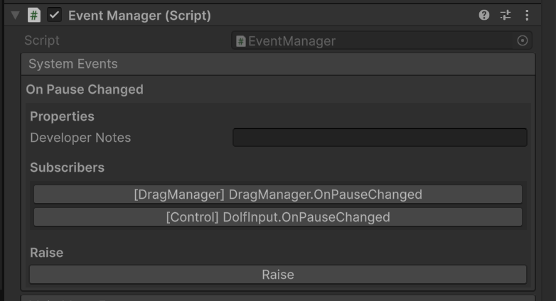
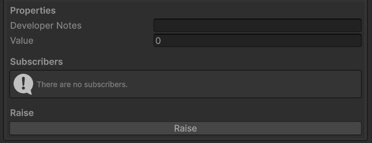

# UnityObservables
Events and observables implemented as ScriptableObjects, but also as plain serialized fields. The folloowing examples are both fields, but the could just as easily be ScriptableObjects. The "Raise" button fires the event, the other buttons ping the subscriber in the editor for debugging purposes,

Example Event (as a field):


Example Observable (as a field):


Example Code:
```
using Studio.ShortSleeve.UnityObservables;
using UnityEngine;

public class Tester : MonoBehaviour
{
    [SerializeField] private EventAssetVoid eventAssetVoid;
    [SerializeField] private ObservableAssetInt observableAssetInt;
    [SerializeField] private EventVoid eventVoid;
    [SerializeField] private ObservableInt observableInt; 

    private float _timeSinceLastRaise;

    void OnEnable()
    {
        observableAssetInt.Subscribe(OnObservableAssetFired);
        eventAssetVoid.Subscribe(OnEventAssetVoidFired);
        observableInt.Subscribe(OnObservableIntFired);
        eventVoid.Subscribe(OnEventVoidFired);
    }

    void OnDisable()
    {
        observableAssetInt.Unsubscribe(OnObservableAssetFired);
        eventAssetVoid.Unsubscribe(OnEventAssetVoidFired);
        observableInt.Unsubscribe(OnObservableIntFired);
        eventVoid.Unsubscribe(OnEventVoidFired);
    }

    void Update()
    {
        if (_timeSinceLastRaise > 1f)
        {
            observableAssetInt.Value++;
            observableInt.Value++;
            _timeSinceLastRaise = 0;
        }

        _timeSinceLastRaise += Time.deltaTime;
    }

    void OnEventAssetVoidFired()
    {
        Debug.Log("EventAssetVoid fired");
    }

    void OnObservableAssetFired(int value)
    {
        Debug.Log("ObservableAsset: " + value);
    }

    void OnEventVoidFired()
    {
        Debug.Log("EventVoid fired");
    }

    public void OnObservableIntFired(int value)
    {
        Debug.Log("Observable: " + value);
    }
}
```
